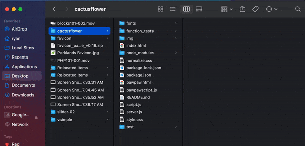
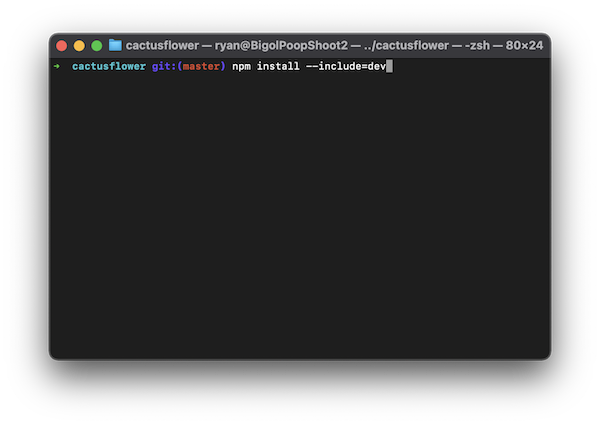
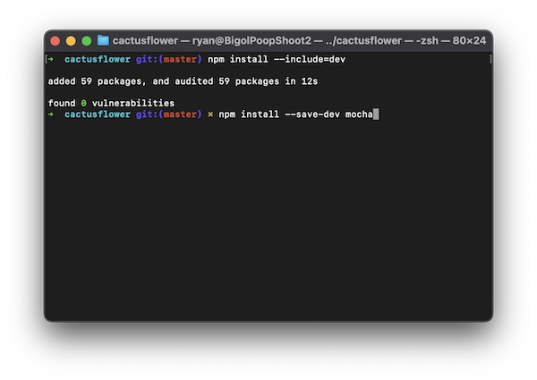
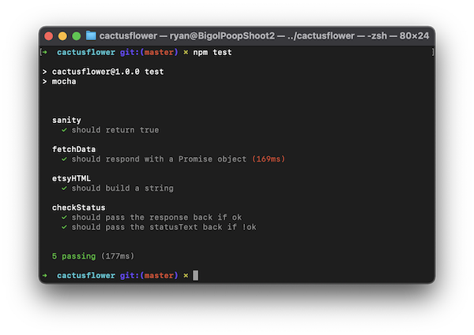
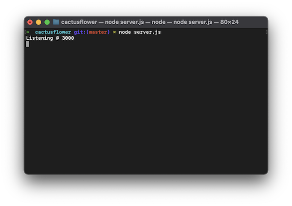
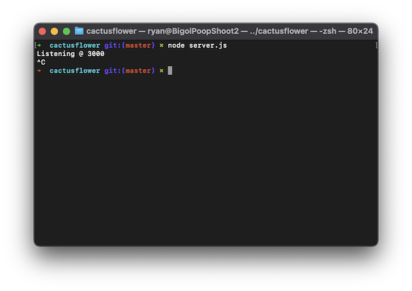

# cactusflower
### Instructions for Code Louisville Grading

1. If you do not already have node installed, do so at [nodejs.org](https://nodejs.org/en/download/).
  
1. After Cloning show hidden files in the folder (`shft + cmd + .` on a mac), delete "_EXAMPLE" from the .env file, open the file, and paste the following API key: **rlk6rfoz714vea6dl8j63eqt**  

  
1. Open the project folder in Terminal and type `npm install --include=dev` to install dependencies.  

  
1. Next, if Mocha is not alrady installed globally, install in the project by typing `npm install --save-dev mocha`.  

  
1. **Requirement:** Type `npm test` to run unit tests.  

  
1. **Requirement:** Type `node server.js` to begin running a proxy server on port 3000.  

  
1. **Requirement:** In your browswer, type `localhost:3000` into the navigation bar to view the results of the stylized data returned from calls to the Etsy API at the bottom of the page. Enjoy your shopping experience!  

  
1. When you are finished shopping, stop the server by typing `ctrl + C` in the terminal.  

